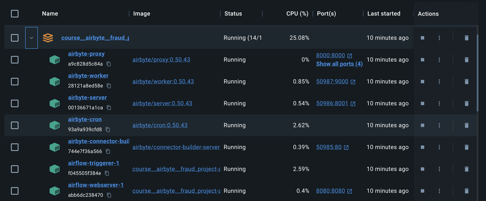
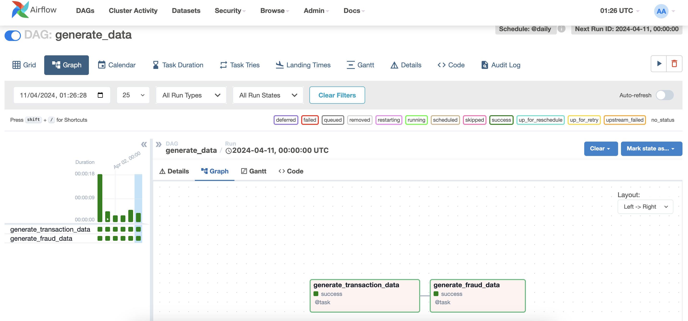
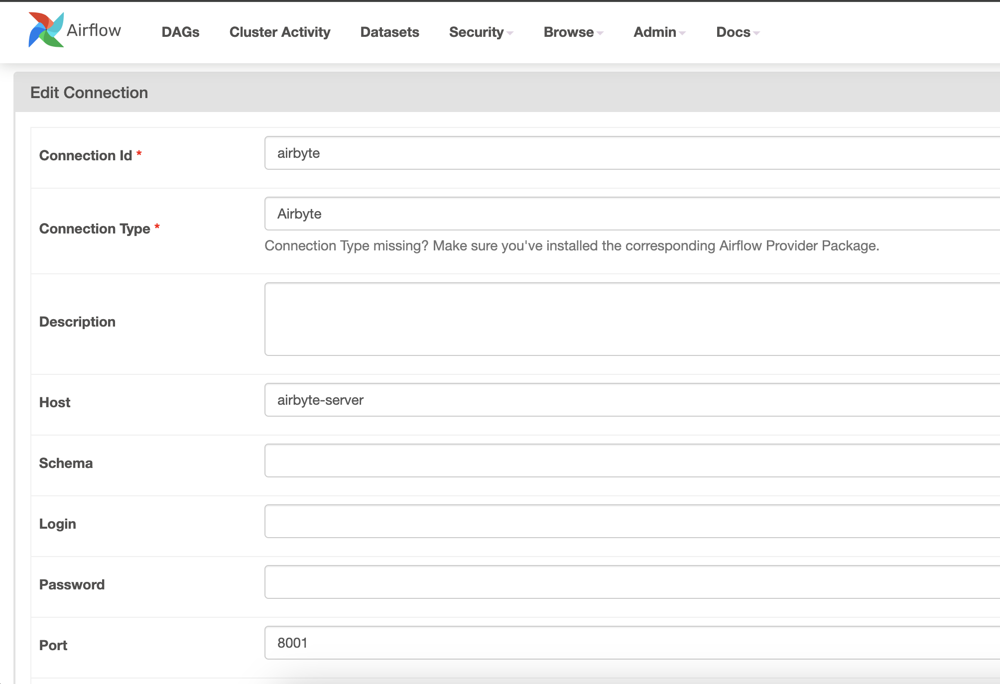
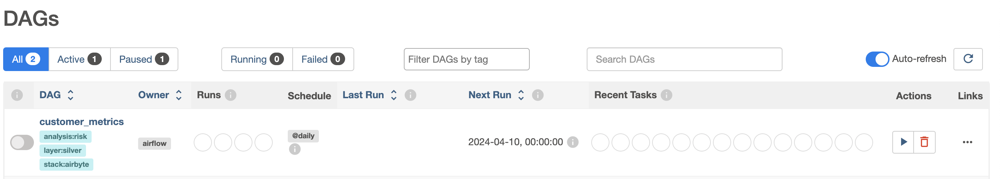
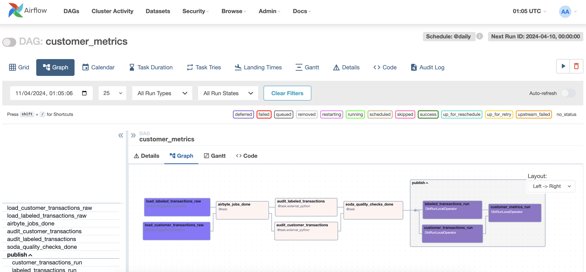

# Fraud Detection Project: Airflow -> Airbyte -> dbt -> SODA

## 0. Installation
All you need to do to install it locally is python3.12 and then run:
```bash
poetry install
```
After this, you can simply start the stack of containers using docker:
```bash
docker compose up -d
```
You might then get a compose stack like this:



## 1. Initializing
Now that you have the containers running, you need to generate your source data. This is done by logging into airflow. To do it open in your browser ```http://localhost:8080```. 
- user: airflow
- password: airflow

Activate and run the DAG ```generate_data```.



After running this DAG, you'll have these tables loaded in these databases:

- MYSQL
    host: 

## Configuration
### Configure the airbyte connection
- Connection id: airbyte
- Connection type: Airbyte
- Host: airbyte-server
- Port: 8001


# The Aiflow DAG
After changing all the necessary variables in the project, you can log into airflow and check this DAG availabe in your DAG list:


The you can select this one and check the details:
