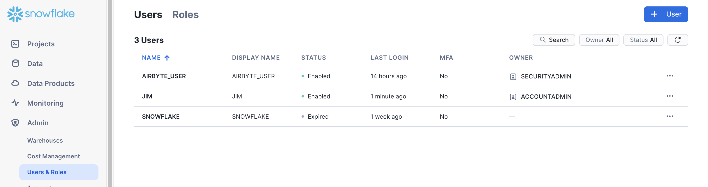
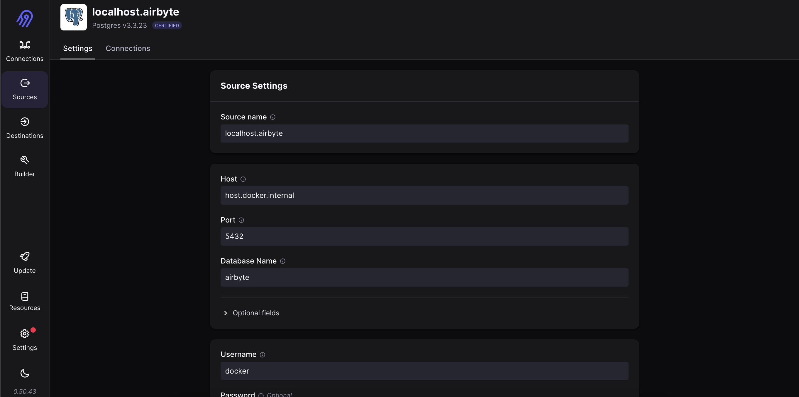
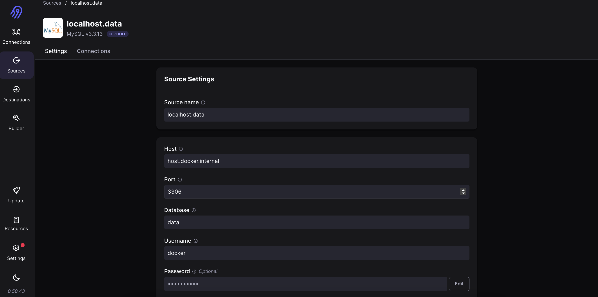
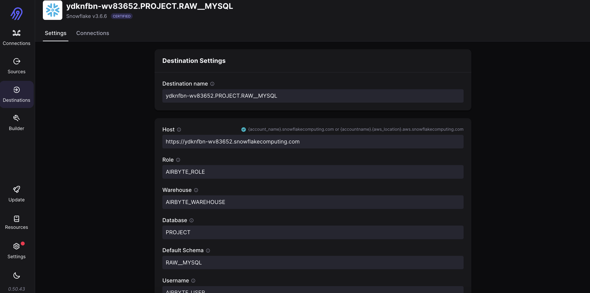
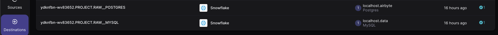

# Fraud Detection Project: Airflow -> Airbyte -> dbt -> SODA

## 0. Installation
All you need to do to install it locally is python3.12 and then run:
```bash
poetry install
```
After this, you can simply start the stack of containers using docker:
```bash
docker compose up -d
```
You might then get a compose stack like this:


## 1. Initializing
Now that you have the containers running, you need to generate your source data. This is done by logging into airflow. To do it open in your browser ```http://localhost:8080```. 
- user: airflow
- password: airflow

Activate and run the DAG ```generate_data```.


After running this DAG, you'll have these tables loaded in these databases (if you wanna check this from your host machine)

- MYSQL
    - host: localhost
    - port: 3306
    - database: data
    - user: docker
    - password: docker
    - table: labeled_transactions

- POSTGRES
    - host: localhost
    - port: 5432
    - database: airbyte
    - user: docker
    - password: docker
    - table: customer transactions

Alright! From these tables, you are going to configure the connections in Airbyte!

## 2. Loading data to airbyte
### 2.1. Snowflake account and pre-requisites
Well, first step is to create an account on [snowflake](https://snowflake.com). You can use any gmail address, it will do. And after that you are going to have a free account with USD$400.00 to spend in a month. More than enough for this project.

After that, you are going to be granted a workspace url for Snowflake and you have to define an admin user. Log in and after this, in the Admin panel, create a user called ```AIRBYTE_USER```, give to it a nice secure password. 



Now, in Snowflake, copy and run the script in [configs/snowflake/sql/prepare-env/prepare-env.sql](configs/snowflake/sql/prepare-env/prepare-env.sql). This will configure ```AIRBYTE_USER``` and the ```PROJECT``` database as required for everything to work.

Alright! now we can load the data!

### 2.2. Loading Staging data to Snowflake using Airbyte
#### Sources
On your browser, you can no go to ```http://localhost:8000```. Use the following credentials to log in:
- user: airbyte
- password: airbyte

On the pane, click 'Sources'  and create a source of type Postgres. I personally use the notation ```host.database``` for the structured sources. So my source for Postgres was defined as:



Notice that both our sources here use ```host.docker.internal```as host, not localhost. This is the only change concernig the connection info I've put before.

For this and the next source, load method is: ```Scan Changes with User Defined Cursor```. Save and test. It must work.

Simmilarly, I've created the source for MySQL as ```localhost.data```.


Define the load method as the previous one and then test and save.

Nice! Now we have both the needed sources!

What we need now is a detination.
#### Destination
In Airbyte, click 'Destinations', on the left panel. For a new destination, select type 'Snowflake'. Diverging with the couurse, I've decided to have a raw/staging area for each source, and not only one for all of them. Tiis is a pattern I've been using in some of my projects, and it helped me a lot with the organization the data and visual tracebility.

So, you've got to create 2 destinations of type Snowflake. Following the naming pattern I generally use, we would have ```{snowflake workspace id}.PROJECT.RAW__{source database vendor}```. Let em give you and example:


To fill the required fields for both the destinations, you can use [this file](configs/airbyte/connections.yml) as reference.

In the end, you must have 2 destinations, just like these:



Now we need to connect the sources and destinations.

### Connections
You'll have to create 2 connections, each one with the corresponding pair 'source-destination'. You might keep any schedule you like, since the data will not change in this project. Scheduling will have just the effect to show you that this functionality in Airbyte really works, but if you really need to see it in action, choose whatever suits you better. In my case, the schedule was defined 'Daily'.

For the source Postgres  and destination RAW__POSTGRES, this is the stream you need to activate and the configs required.


## Configuration
### Configure airbyte connection
- Connection id: airbyte
- Connection type: Airbyte
- Host: airbyte-server
- Port: 8001


# The Aiflow DAG
After changing all the necessary variables in the project, you can log into airflow and check'em is available in your DAG list:


The you can select this one and check the details:


Notice that the DAG is basically generated in an automated manner by importing and using this beautiful tool called 'cosmos'.
```python
from cosmos.airflow.task_group import DbtTaskGroup
```